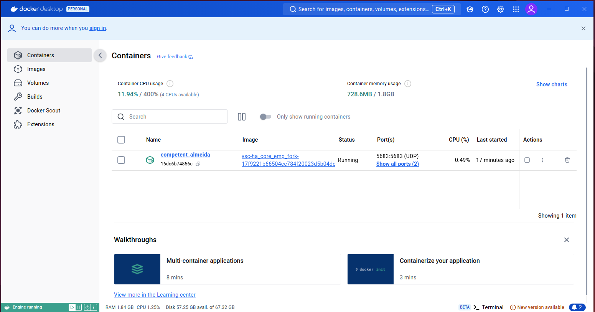
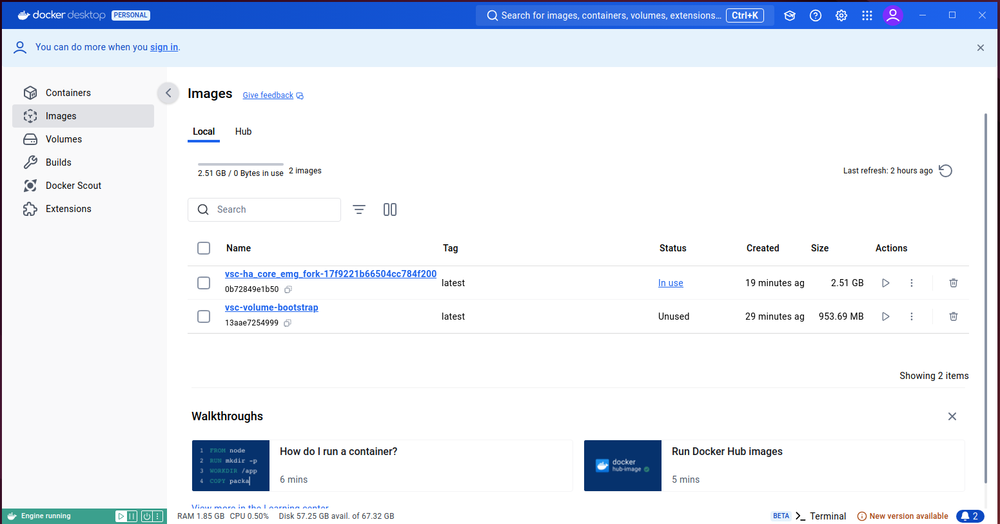
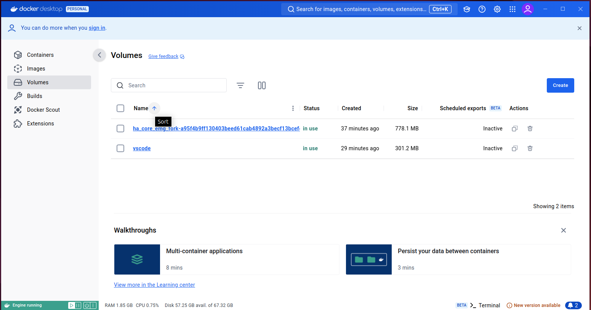
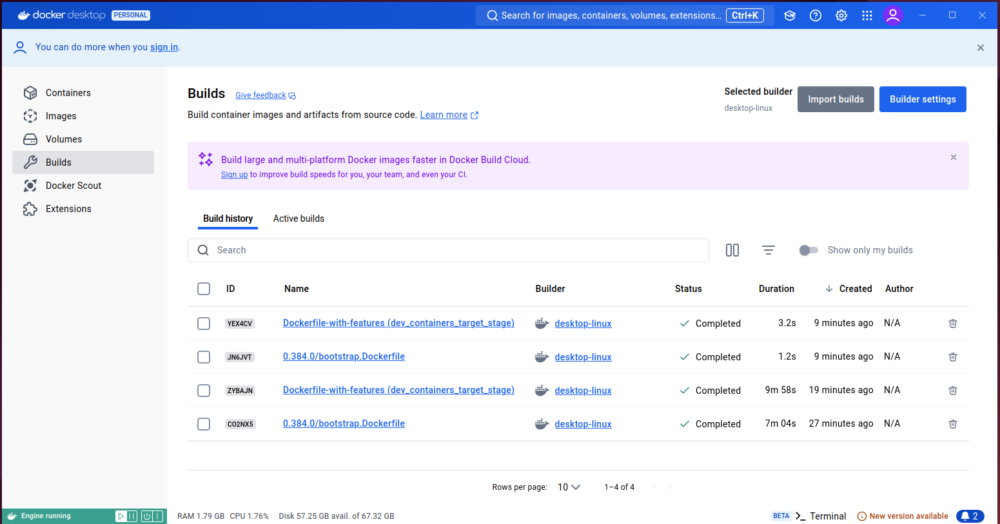
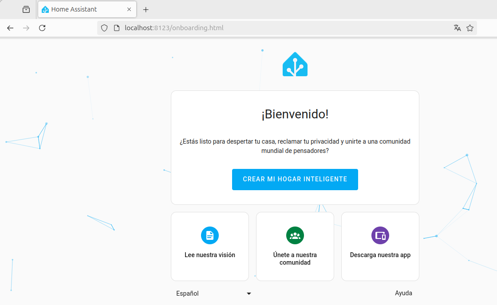

## PREPARAR VISUAL STUDIO CODE PARA DESARROLLAR PARA HOME ASSISTANT
Toda la información esta extraida de 

https://developers.home-assistant.io/docs/development_environment/

### 1. Sin Dev Containers
Seguir este manual [dev_without_containers](./dev_without_containers.md)

### 2. Con Dev Container
Una vez tenemos el entorno preparado con Docker y Visual Studio Code, comenzamos a utilizarlo para disponer de una versión del core de Home Assistant sobre el que poder desarrollar nuevas funcionalidades y hacer pruebas

En el punto en el que nos encontramos deberiamos comenzar directamente haciendo un Fork del repositorio de HA en nuestro Github
https://github.com/home-assistant/core

Una vez hecho seguir las instrucciones.
Antes de darle al botón es necesario que Docker Desktop ya este corriendo. Buscar la aplicación en el cajón de aplicaciones de Ubuntu y lanzarla.

Al darle al botón se abrirá Visual Code, clonará localmente nuestro frok de HA e instalará Dev Containers. El proceso completo puede llegar a tardar 1 hora.

Es posible que el navegador no este bien configurado para ejecutar el comando que se ejecuta al presionar el botón. Si no funciona a la primera desde Firefox seguir los pasos indicados más abajo.
Cuando el proceso termine deberiamos tener algo similar esto en Docker Desktop:





Los contenedores ya están preparados pero falta un ultimo paso antes de poder ver nuestra instancia de Home Assistant.
En Visual Studio Code presionar Ctrl+Mayus+P para poder abrir la paleta de comandos. Mas info sobre esto en [vsc_command_pallete](./vsc_command_pallete.md)

En la paleta de comandos escribir Tasks: Run Task -> Run Home Assistant Core

Si todo ha ido bien y no se generan errores ya podremo acceder a HA desde:
http://localhost:8123

En mi caso Dev Containers no instaló automaticamente todas las dependencias y en un terminal dentro del workspace tuve que hacer:
````bash
pip install aiohasupervisor
hass -c ./config
````
Nota: las dependencias suelen estar definidas en ficheros como `homeassistant/requirements.txt` dentro de los distintos scripts de Python.
A estos requerimientos se hace referencia dentro del fichero Dockerfile que los utiliza para configurar el entorno.
Resulta interesante que la solución al problema fue aportada por Copilot (boton derecho del ratón sobre el terminal que arrojaba los errores).

Finalmente se comprueba el resultado:


En caso de fallos y cuando se hagan cambios reconstruir el contenedor tal como se indica en [rebuild_dev_containers](./rebuild_dev_containers.md)

## A partir de aqui ya es entrar en materia...

... para lo que pueden ser utiles los siguiente documentos:

Información sobre Docker en este documento [docker_info](./docker_info.md)

Información sobre Visual Studio Code en este documento [vsc_info](./vsc_info.md)

Información sobre Dev Containers en este documento [dev_containers](./dev_containers.md)

Información sobre el uso de git y Github en este documento [github_intro](./github_intro.md)


### **Solo** si no abre Visual Studio al presionar el botón del tutorial de la web oficial en `Firefox`
Para permitir enlaces personalizados en Firefox como vscode://, sigue estos pasos:
Abre una nueva pestaña en Firefox y escribe about:config en la barra de direcciones, luego presiona Enter.
Verás una advertencia que dice "Tendré cuidado, lo prometo". Haz clic en el botón para continuar.
Busca el siguiente parámetro en la barra de búsqueda superior:
````bash
network.protocol-handler.expose.vscode
````
Si el parámetro no existe, créalo haciendo clic con el botón derecho en cualquier parte de la lista de configuraciones, selecciona Nuevo > Booleano.
Nombra la clave como network.protocol-handler.expose.vscode y establece el valor en false.
A continuación, vuelve a hacer clic derecho y selecciona Nuevo > Booleano. Esta vez, crea el parámetro network.protocol-handler.external.vscode y configúralo en true.
Cierra la pestaña de about:config.
La próxima vez que intentes abrir un enlace vscode://, Firefox te debería preguntar si deseas abrir Visual Studio Code.

Como alternatica tambien se puede abrir el enlace manualmente en Visual Studio Code
Si Firefox no te permite abrir el enlace directamente, puedes clonar el repositorio de GitHub manualmente y abrirlo en Visual Studio Code. Sigue estos pasos:
Clonar el repositorio usando git o la opción de "clonar en contenedor" de Visual Studio Code:
En tu terminal, ejecuta el siguiente comando:
````bash
git clone https://github.com/mgenrique/ha_core_emg_fork
````
Una vez clonado, abre Visual Studio Code y selecciona Remote-Containers (si tienes la extensión instalada). Luego sigue estos pasos:

Abre Visual Studio Code.
Ve a la paleta de comandos con Ctrl + Shift + P.
Escribe Remote-Containers: Open Folder in Container.
Navega al directorio donde clonaste el repositorio y ábrelo.
