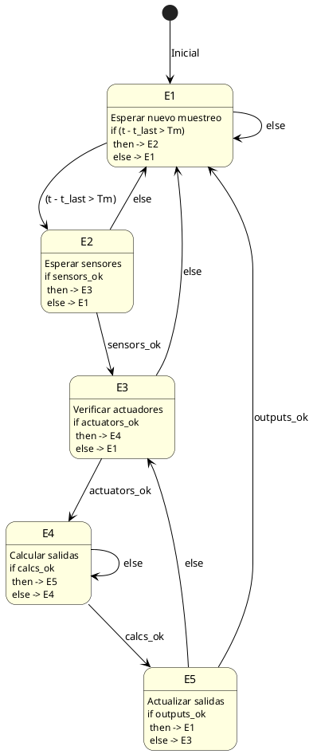
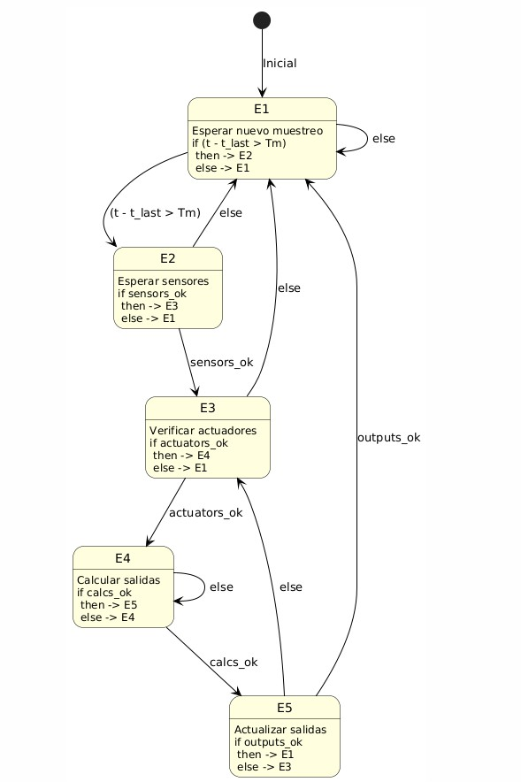

Con PlantUML, me gustaria definir una maquina de estados con las siguientes caracteristicas:
t es el tiempo actual,  t_last el tiempo de la última lectura, Tm es el peroido de muestreo
sensors_ok, y actuators_ok, calcs_ok, outputs_ok representan valores booleanos que reflejan si sensores, actuadores, calculos y salidas están disponibles.
Estados:
E1: esperar nuevo muestreo
E2: esperar sensores
E3: verificar actuadores
E4: calcular salidas
E5: actualizar salidas

Funcionamiento: 
En E1 if (t-tlast>Tm) then E2 else E1
En E2, if sensors_ok then E3 else E1
En E3, if actuators_ok then E4 else E1
En E4, if calcs_ok then E5 else E4
En E5, if outputs_ok then E1 else E3

Para definir una máquina de estados en **PlantUML** con las características que describes, puedes usar la sintaxis de máquinas de estados de PlantUML. A continuación, te proporciono una implementación para representar los estados y transiciones según tu descripción.

### Código de PlantUML para tu máquina de estados:

### Explicación:
- **Estado inicial**: El diagrama comienza en el estado `E1` (Esperar nuevo muestreo).
- **Transiciones**:
  - En `E1`, si el tiempo actual menos el tiempo de la última lectura es mayor que el período de muestreo (`t - t_last > Tm`), pasa a `E2`. De lo contrario, permanece en `E1`.
  - En `E2`, si `sensors_ok` es verdadero, pasa a `E3`. Si no, regresa a `E1`.
  - En `E3`, si `actuators_ok` es verdadero, pasa a `E4`. Si no, regresa a `E1`.
  - En `E4`, si `calcs_ok` es verdadero, pasa a `E5`. Si no, permanece en `E4`.
  - En `E5`, si `outputs_ok` es verdadero, regresa a `E1`. Si no, regresa a `E3`.

Este diagrama de estados visualiza claramente el flujo de trabajo con todas las condiciones lógicas para cambiar entre los estados. Puedes copiar este código y probarlo en cualquier editor que soporte PlantUML para generar la imagen del diagrama de estado.

https://plantuml.com/es/state-diagram

El resultado de este código llevado al servidor de PlantUML es el siguiente:

