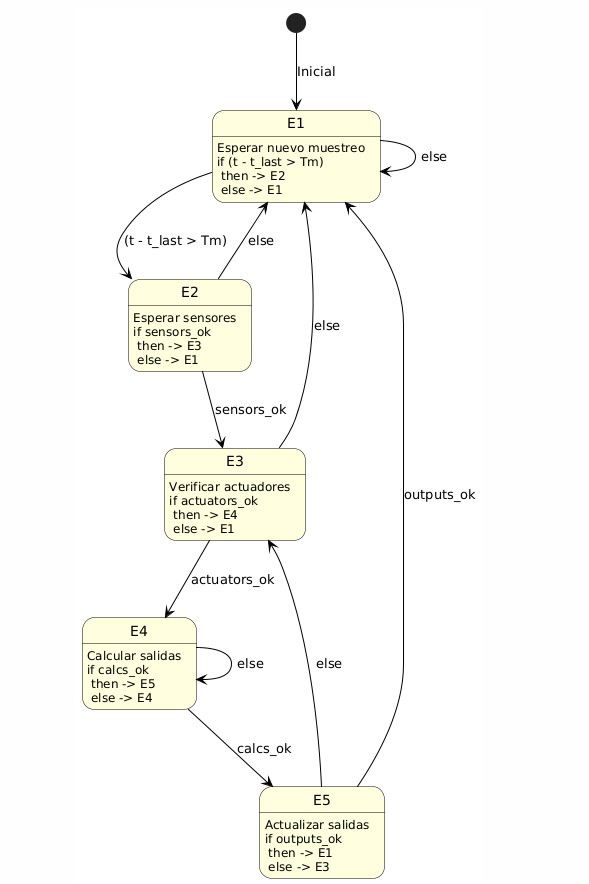

# Lenguaje PlantUML

Para explicar la sintaxis de PlantUML lo mejor es ver un par de ejemplos, sobre un caso concreto.

Con PlantUML, vamos a intentar definir una maquina de estados con las siguientes caracteristicas:
t es el tiempo actual,  t_last el tiempo de la última lectura, Tm es el peroido de muestreo
sensors_ok, y actuators_ok, calcs_ok, outputs_ok representan valores booleanos que reflejan si sensores, actuadores, calculos y salidas están disponibles.
Estados:
E1: esperar nuevo muestreo
E2: esperar sensores
E3: verificar actuadores
E4: calcular salidas
E5: actualizar salidas

Funcionamiento: 
En E1 if (t-tlast>Tm) then E2 else E1
En E2, if sensors_ok then E3 else E1
En E3, if actuators_ok then E4 else E1
En E4, if calcs_ok then E5 else E4
En E5, if outputs_ok then E1 else E3


### Código de PlantUML para tu máquina de estados:

```plantuml
@startuml
skinparam state {
  BackgroundColor LightYellow
  BorderColor Black
  ArrowColor Black
}

[*] --> E1 : Inicial

state E1 : Esperar nuevo muestreo
state E2 : Esperar sensores
state E3 : Verificar actuadores
state E4 : Calcular salidas
state E5 : Actualizar salidas

E1 : if (t - t_last > Tm)\n then -> E2\n else -> E1
E2 : if sensors_ok\n then -> E3\n else -> E1
E3 : if actuators_ok\n then -> E4\n else -> E1
E4 : if calcs_ok\n then -> E5\n else -> E4
E5 : if outputs_ok\n then -> E1\n else -> E3

E1 --> E2 : (t - t_last > Tm)
E1 --> E1 : else
E2 --> E3 : sensors_ok
E2 --> E1 : else
E3 --> E4 : actuators_ok
E3 --> E1 : else
E4 --> E5 : calcs_ok
E4 --> E4 : else
E5 --> E1 : outputs_ok
E5 --> E3 : else

@enduml
```

### Explicación:
- **Estado inicial**: El diagrama comienza en el estado `E1` (Esperar nuevo muestreo).
- **Transiciones**:
  - En `E1`, si el tiempo actual menos el tiempo de la última lectura es mayor que el período de muestreo (`t - t_last > Tm`), pasa a `E2`. De lo contrario, permanece en `E1`.
  - En `E2`, si `sensors_ok` es verdadero, pasa a `E3`. Si no, regresa a `E1`.
  - En `E3`, si `actuators_ok` es verdadero, pasa a `E4`. Si no, regresa a `E1`.
  - En `E4`, si `calcs_ok` es verdadero, pasa a `E5`. Si no, permanece en `E4`.
  - En `E5`, si `outputs_ok` es verdadero, regresa a `E1`. Si no, regresa a `E3`.

Este diagrama de estados visualiza claramente el flujo de trabajo con todas las condiciones lógicas para cambiar entre los estados. Puedes copiar este código y probarlo en cualquier editor que soporte PlantUML para generar la imagen del diagrama de estado.

https://plantuml.com/es/state-diagram

El resultado de este código llevado al servidor de PlantUML es el siguiente:



## Variante 2
```plantuml
@startuml
skinparam state {
  BackgroundColor lightblue 
  BorderColor Black
  ArrowColor Black
}

[*] --> E1 : Inicialización

state E1 : ESPERAR NUEVO CICLO
state fork_state_1 <<fork>>
state E2 : ESPERAR SENSORES
state E3 : VERIFICAR INVERSOR
state join_state_1 <<fork>>
state E4 : CALCULAR SALIDAS
state E5 : ACTUALIZAR SALIDAS
E1 --> fork_state_1 : (t - t_last > Tm)
fork_state_1 --> E2
fork_state_1 --> E3
state join_state_1 <<join>>
E2 --> join_state_1 : sensors_ok
E3 --> join_state_1 : inverter_ok
join_state_1 --> E4
E4 --> E5 : calcs_ok
E5 --> [*]

state E2 : PVPC proximas horas 
state E2 : Forecast Solar 
state E2 : Forecast Energia a consumir
state E2 : SoC actual de la batería
state E2 : Watios consumidos ahora
state E3 : ¿Control externo habilitado?

@enduml
````

El resultado de este código llevado al servidor de PlantUML es el siguiente:


