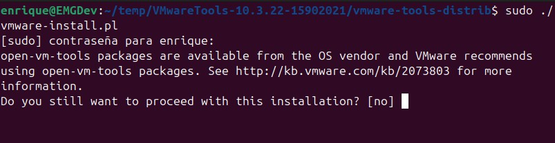

# Configuración de Docker Desktop y Visual Studio Code en Ubuntu sobre máquina virtual VMware

Este documento describe los pasos necesarios para configurar un entorno de desarrollo en Ubuntu, basado en Docker Desktop y Visual Studio Code, para desarrollar contenedores Docker.
La instalación se realiza sobre una maquina virtual que trabaja en VMWare Workstation 16 Pro, en la que se ha instalado el sistema operativo a partir de la imagen
ubuntu-24.04.1-desktop-amd64.iso

Los ajustes utilizados en VMWare se muestran a continuación:


Es importante para trabajar con Docker marcar la opción Virtualize Intel VT-x/EPT or AMD-V/RVI. Esto nos permitirá usar KVM virtualization support en Ubuntu


No se recomienda instalar las VMWare tools que proporciona VMware Workstation. Ubuntu utiliza las open-vm-tools y dan menos problemas



Instalar open-vm-tools en Ubuntu
Asegúrate de tener open-vm-tools instalado en tu máquina virtual Ubuntu. Puedes hacerlo ejecutando los siguientes comandos en la terminal de Ubuntu:
```bash
sudo apt update
sudo apt install open-vm-tools open-vm-tools-desktop
```
En algún momento puede aparecer un problema con la virtualización en VMWare: Virtualized Intel VT-X/EPT is not supported on this platform
La solución en esta guia: hyperv_problem.md
[hyperv_problem](./Docs/hyperv_problem.md)

Otras consideraciones útiles para el manejo de maquinas virtuales con VMware se pueden consultar en [Info VMware](./Docs/vmware_info.md)

## Descripción del entorno de desarrollo

Todo lo indicado en este docuemnto está orientado a disponer de un entorno de desarrollo para `Home Assitant`

La información se ha obtenido de https://developers.home-assistant.io/docs/development_environment/

El objetivo es disponer de un equipo en el que se puedan utilizar y desarrolar contenedores Docker. [info sobre Docker](./Docs/docker_info.md)
Para ello se necesitará tener instalado Visual Studio Code [info VSC](./Docs/vsc_info.md)
Dentro de VSC, la forma de desarrollar contenedores pasa por disponer del complemento Dev Containers. [Info Dev Containers](./Docs/dev_containers.md)
Además será necesario disponer de un usuario registrado en Github, y que este quede integrado dentro del sistema. [Info Git](./Docs/github_intro.md)

## 1. Actualizar el sistema

Primero, asegúrate de que tu sistema esté actualizado:

```bash
sudo apt update && sudo apt upgrade -y
```

## 2. Instalar soporte para virtualización KVM

```bash
sudo apt update
sudo apt install qemu-kvm libvirt-daemon-system libvirt-clients bridge-utils virt-manager
```
Para permitir que tu usuario normal gestione las máquinas virtuales, añade tu usuario al grupo libvirt:

````bash
sudo adduser $(whoami) libvirt
````
Comprueba que KVM está funcionando correctamente
````bash
sudo kvm-ok
````
Asegúrate de que los servicios de libvirt estén en ejecución y habilitados al inicio:
````bash
sudo systemctl start libvirtd
sudo systemctl enable libvirtd
````
Para verificar quien es el propietario del servicio KVM 
````bash
ls -al /dev/kvm
````
Para añadir el usuario actual al grupo de usaurios con permiso para usar el servicio KVM 
````bash
sudo usermod -aG kvm $USER
````
Hay un problema de compatibilidad entre Docker Desktop y Ubuntu 24.04 LTS que obliga a ejecutar lo siguiente:
````bash
sudo sysctl -w kernel.apparmor_restrict_unprivileged_userns=0
````
Esta instrucción solo tiene efecto durante la sesion en que se ejecuta por lo que se requiere introducirla en la configuración de arranque:
````bash
sudo nano /etc/sysctl.conf
````
Donde se debe intrucir la siguiente línea al final del archivo
````bash
kernel.apparmor_restrict_unprivileged_userns=0
````
Para aplicar los cambios sin reiniciar, ejecuta el siguiente comando
````bash
sudo sysctl -p
````

## 3. Instalar dependencias necesarias

Docker Desktop requiere algunas dependencias adicionales que debes instalar:

```bash
sudo apt install apt-transport-https ca-certificates curl software-properties-common linux-modules-extra-$(uname -r)
```

## 4. Instalar Docker Desktop
Lo primero será instalar docker-ce (el engine de docker) y docker-ce-cli (la interface de linea de comandos de Docker). Para ello:
````bash
sudo apt update
sudo apt install apt-transport-https ca-certificates curl software-properties-common
curl -fsSL https://download.docker.com/linux/ubuntu/gpg | sudo apt-key add -
sudo add-apt-repository "deb [arch=amd64] https://download.docker.com/linux/ubuntu $(lsb_release -cs) stable"
sudo apt update
sudo apt install docker-ce
sudo apt install docker-ce-cli
docker --version
````
Sigue los siguientes pasos para instalar Docker Desktop en Ubuntu:

### 4.1 Descargar Docker Desktop para Linux:

Ve al sitio oficial de Docker y descarga la versión más reciente de Docker Desktop para Linux:

[Docker Desktop para Linux](https://www.docker.com/products/docker-desktop)

O laternativamente, localiza un directorio temporal y en un terminal descargalo con la siguiente instrucción:

```bash
curl -LO https://desktop.docker.com/linux/main/amd64/docker-desktop-amd64.deb

```

### 4.2 Instalar Docker Desktop:

Una vez descargado el archivo `.deb`, instálalo con:

```bash
sudo dpkg -i docker-desktop-amd64.deb
```

Si hay dependencias faltantes, puedes corregirlas con:

```bash
sudo apt --fix-broken install
```

### 4.3 Configurar Docker Desktop para ejecutarse como root:

Después de la instalación, es posible que necesites iniciar Docker Desktop con permisos de root:

```bash
sudo systemctl start docker
sudo docker run hello-world
```

### 4.4 Añadir tu usuario al grupo `docker` (opcional):

Para evitar usar `sudo` en cada comando de Docker, puedes añadir tu usuario al grupo `docker`:

```bash
sudo usermod -aG docker $USER
```

Luego cierra sesión y vuelve a entrar para aplicar los cambios.

## 5. Establecer usario para GIT
Para que Git registre correctamente tus contribuciones, debes configurar tu nombre y correo electrónico. Esto se hace globalmente (para todos los repositorios en tu sistema) o a nivel de repositorio individual.

Configuración global (para todos los repositorios)
Para configurar tu nombre y correo electrónico globalmente, usa los siguientes comandos:
```bash
git config --global user.name "mgenrique"
git config --global user.email "tu-email@example.com"
```
Esta configuración se almacena en el archivo de configuración global de Git (~/.gitconfig), lo que garantiza que esta información esté disponible para todos los repositorios en tu sistema.

Configuración a nivel de repositorio (opcional)
Si necesitas usar una configuración diferente para un repositorio específico, navega al directorio del repositorio y usa los comandos sin la opción --global:

```bash
cd /ruta/al/repositorio
git config user.name "otro_usuario"
git config user.email "otro-email@example.com"
```
Para confirmar que tu configuración se ha guardado correctamente, puedes verificarla con los siguientes comandos:

````bash
git config --global --list
````

Para ver la configuración en un repositorio específico, usa:
````bash
git config --list
````

Otras configuraciones útiles
````bash
git config --global core.editor "nano"
git config --global color.ui auto
````
Si estás usando servicios como GitHub o GitLab, asegúrate de configurar las claves SSH para autenticarte con esos servicios. Esto es especialmente útil para evitar tener que ingresar tu nombre de usuario y contraseña repetidamente.
Para generar una clave SSH y agregarla a tu cuenta en GitHub o GitLab, sigue estos pasos:
````bash
ssh-keygen -t ed25519 -C "tu-email@example.com"
````
Esta operacion se puede hacer en una carpeta temporal y finalmente llevarla al almacen de claves con los comandos:
````bash
mv ./miclave_ssh ~/.ssh/
mv ./miclave_ssh.pub ~/.ssh/
````
Luego ajustar los permisos de los archivos
````bash
chmod 600 ~/.ssh/miclave_ssh
chmod 644 ~/.ssh/miclave_ssh.pub
````
Comprobar si el agente SSH está funcionando
````bash
eval "$(ssh-agent -s)"
````

Agregar la clave al agente SSH
````bash
ssh-add ~/.ssh/miclave_ssh
````

Luego, agrega la clave pública (~/.ssh/id_ed25519.pub) a tu cuenta en GitHub o GitLab. Se puede abrir el contenido con un editor de texto, copiar todo y pegarlo en Github


Para comprobar que todo funciona
````bash
ssh -T git@github.com
````
Deberías recibir un mensaje de bienvenida de GitHub si todo está configurado correctamente.

Más información sobre el uso de git y Github en este documento [github_intro](./Docs/github_intro.md)


## 6. Instalar Visual Studio Code

### 6.1 Instalar el repositorio de Microsoft para VS Code:

```bash
sudo apt install wget gpg
wget -qO- https://packages.microsoft.com/keys/microsoft.asc | gpg --dearmor > packages.microsoft.gpg
sudo install -o root -g root -m 644 packages.microsoft.gpg /usr/share/keyrings/
sudo sh -c 'echo "deb [arch=amd64 signed-by=/usr/share/keyrings/packages.microsoft.gpg] https://packages.microsoft.com/repos/code stable main" > /etc/apt/sources.list.d/vscode.list'
```

### 6.2 Instalar Visual Studio Code:

```bash
sudo apt update
sudo apt install code
```

## 7. Configurar Visual Studio Code para Docker

### 7.1 Instalar la extensión de Docker:

Abre Visual Studio Code y busca la extensión **Docker** en el marketplace. También puedes instalarla desde la terminal con:

```bash
code --install-extension ms-azuretools.vscode-docker
```

### 7.2 Instalar la extensión de WSL (opcional):

Si planeas usar Docker con **WSL2** (Windows Subsystem for Linux), también deberías instalar la extensión **Remote - WSL**:

```bash
code --install-extension ms-vscode-remote.remote-wsl
```

## 8. Verificar la integración de Docker con Visual Studio Code

1. Abre Visual Studio Code.
2. En el panel lateral izquierdo, haz clic en el ícono de Docker (una ballena).
3. Deberías poder ver los contenedores, imágenes y redes de Docker en ejecución.
4. Crea un archivo `Dockerfile` en un proyecto y empieza a desarrollar tu contenedor.

## 9. Usar Docker Compose (opcional)

Si trabajas con múltiples contenedores, puedes usar Docker Compose. Instálalo con:

```bash
sudo apt install docker-compose
```

En **VS Code**, asegúrate de que la extensión de Docker también soporte la configuración de `docker-compose.yml`.

## 10. Probar la instalación

Crea un contenedor de prueba desde **VS Code**:

1. Abre un proyecto en VS Code.
2. Crea un archivo `Dockerfile`:

```Dockerfile
FROM node:14
WORKDIR /app
COPY . .
RUN npm install
CMD ["npm", "start"]
```
3. Ejecuta el contenedor con los comandos de Docker integrados en el editor o desde la terminal.

Con estos pasos, tendrás un entorno de desarrollo completo para trabajar con contenedores Docker desde Ubuntu, usando Docker Desktop y Visual Studio Code.


Una vez hecho anterior se puede finalmente proceder a la configuración especifica para Home Assistant
[Configurar HA Dev](./Docs/configure_HA_dev.md)


