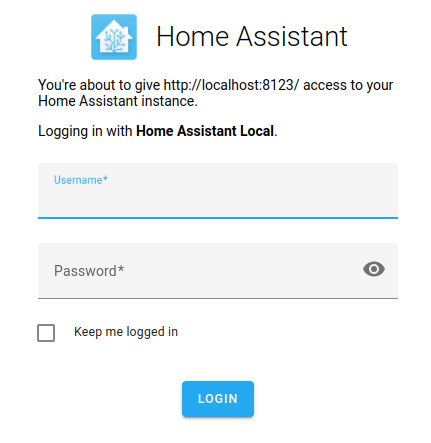
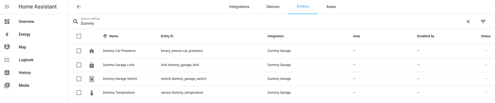
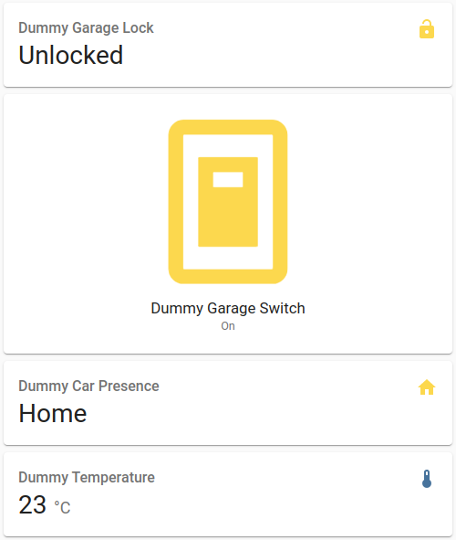
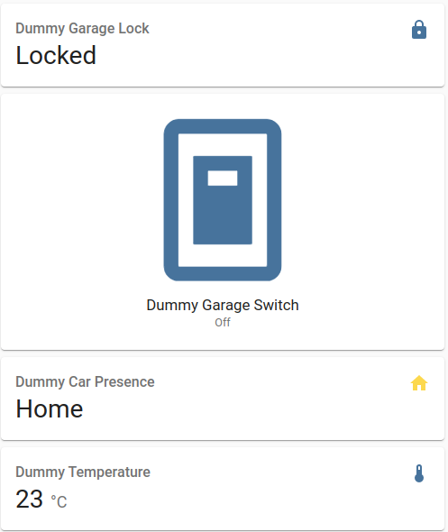

# Home Assistant Component - Dummy Garage

> This is a dummy component which integrates with binary sensor, lock, sensor and switch platforms for demonstrating the development of custom components used in Home Assistant.

## Development

1. Setup development environment as described in the following URL:

    `https://developers.home-assistant.io/docs/development_environment/`

2. Generate the skeleton codes for integration by executing the following command:

    `python3 -m script.scaffold integration`

    An interative Q&A session then starts.  When it finishes, it will generate the skeleton codes.

    ```shell
    What is the domain?
    > dummy_garage
   
    What is the name of your integration?
    > Dummy Garage
   
    What is your GitHub handle?
    > @adafycheng
   
    What PyPI package and version do you depend on? Leave blank for none.
    >
   
    How will your integration gather data?
   
    Valid values are assumed_state, calculated, cloud_polling, cloud_push, local_polling, local_push
   
    More info @ https://developers.home-assistant.io/docs/creating_integration_manifest#iot-class
   
    > local_polling
   
    Does Home Assistant need the user to authenticate to control the device/service? (yes/no) [yes]
    > no
   
    Is the device/service discoverable on the local network? (yes/no) [no]
    > no
   
    Is this a helper integration? (yes/no) [no]
    > yes
   
    Can the user authenticate the device using OAuth2? (yes/no) [no]
    > no
   
    Scaffolding integration for the dummy_garage integration...
    Writing tests/components/dummy_garage/__init__.py
    Writing homeassistant/components/dummy_garage/const.py
    Writing homeassistant/components/dummy_garage/manifest.json
    Writing homeassistant/components/dummy_garage/__init__.py
    Updating dummy_garage manifest: {'codeowners': ['@adafycheng'], 'iot_class': 'local_polling'}
   
    Scaffolding config_flow_helper for the dummy_garage integration...
    Writing homeassistant/components/dummy_garage/const.py
    Writing homeassistant/components/dummy_garage/__init__.py
    Writing homeassistant/components/dummy_garage/sensor.py
    Writing homeassistant/components/dummy_garage/config_flow.py
    Writing tests/components/dummy_garage/test_config_flow.py
    Writing tests/components/dummy_garage/test_init.py
    Updating dummy_garage manifest: {'config_flow': True}
    Updating dummy_garage strings: ['config', 'options']
   
    Running hassfest to pick up new information.
   
    Running gen_requirements_all to pick up new information.
   
    Running script/translations_develop to pick up new translation strings.
   
   
    **************************
   
   
    Integration code has been generated
   
    Added the following files:
    - homeassistant/components/dummy_garage/config_flow.py
    - homeassistant/components/dummy_garage/manifest.json
    - homeassistant/components/dummy_garage/const.py
    - homeassistant/components/dummy_garage/sensor.py
    - homeassistant/components/dummy_garage/__init__.py
   
    Added the following tests:
    - tests/components/dummy_garage/test_init.py
    - tests/components/dummy_garage/test_config_flow.py
   
    The next step is to look at the files and deal with all areas marked as TODO.
    ```

3. In this integration, since we create the entities by configuration, therefore we clear most of the codes `in __init__.py`.

4. For each of the platforms,

    i. Define the **PLATFORM_SCHEMA** (mandatoriness and data type) for getting the inputs from configuration.yaml.

    ```python
    import voluptuous as vol

    from homeassistant.components.sensor import (
        PLATFORM_SCHEMA,
        SensorDeviceClass,
        SensorEntity,
        SensorStateClass,
    )

    DEFAULT_NAME = "Dummy Garage - Sensor"
    
    PLATFORM_SCHEMA = PLATFORM_SCHEMA.extend(
    {
        vol.Required(CONF_MAC): cv.string,
        vol.Optional(CONF_NAME, default=DEFAULT_NAME): cv.string,
    }
    )

    ```

    ii. Add a `async_setup_platform` function to be called when the platform is being setup.  In this function, the entity will be created and added to Home Assistant.

    ```python
    async def async_setup_platform(
        hass: HomeAssistant,
        config: ConfigType,
        add_entities: AddEntitiesCallback,
        discovery_info: DiscoveryInfoType | None = None,
    ) -> None:
        """Set up the sensor platform."""
        name = config[CONF_NAME]
        mac_addr = config[CONF_MAC]

        add_entities([DummyGarageSensor(mac_addr, name)], True)
    ```

    iii. Create a class with the Entity class corresponding to the platform as the input parameter.

    - The `__init__` function is the constructor of the class.
    - The `name` function returns as the Name of the entity shown in the Home Assistant Web Application.
    - The `unique_id` function returns as the unique ID of the entity.  I transform the input MAC address to a unique ID.
   
    ```python
    class DummyGarageSensor(SensorEntity):
        """Representation of a Sensor."""
   
        def __init__(self, mac, name) -> None:
            super().__init__()
            self._mac = mac
            self._name = name
            self._attr_name = name
            self._attr_native_unit_of_measurement = TEMP_CELSIUS
            self._attr_device_class = SensorDeviceClass.TEMPERATURE
            self._attr_state_class = SensorStateClass.MEASUREMENT
   
        @property
        def name(self) -> str:
            """Return the name of the switch."""
            return self._name
   
        @property
        def unique_id(self) -> str:
            """Return a unique, Home Assistant friendly identifier for this entity."""
            return self._mac.replace(":", "")
   
        def update(self) -> None:
            """Fetch new state data for the sensor.
   
            This is the only method that should fetch new data for Home Assistant.
            """
            self._attr_native_value = 23
    ```

## Deployment

1. Copy the directory homeassistant/components/dummy_garage/ to the Home Assistant Core /homeassistant/components/.

2. Add configuration for the desired entities in the `config/configuration.yaml` file.

    ```yaml
    binary_sensor:
    - platform: dummy_garage
      name: "Dummy Car Presence"
      mac: "12:34:12:34:12:34"
      device_class: "presence"
   
    lock:
    - platform: dummy_garage
      name: "Dummy Garage Lock"
      mac: "EF:EF:EF:EF:EF:EF"
   
    switch:
    - platform: dummy_garage
      name: "Dummy Garage Switch"
      mac: "AB:AB:AB:CD:CD:CD"
   
    sensor:
    - platform: dummy_garage
      name: "Dummy Temperature"
      mac: "56:34:12:90:78:56"
    ```

3. For testing purpose, add automations for opening and closing the garage door in the `config/automations.yaml` file.  Remember to change the values of `entity_id` if they are different from this example. 

    ```yaml
    - id: open_garage
      alias: "Open Garage Door"
      trigger:
        - platform: time_pattern
          minutes: 5
        - platform: time_pattern
         minutes: 15
        - platform: time_pattern
          minutes: 25
        - platform: time_pattern
          minutes: 35
        - platform: time_pattern
          minutes: 45
        - platform: time_pattern
          minutes: 55
      action:
        - service: lock.unlock
          target:
            entity_id: lock.dummy_garage_lock
        - delay: 00:00:10
        - service: switch.turn_on
          target:
            entity_id: switch.dummy_garage_switch
   
    - id: close_garage
      alias: "Close Garage Door"
      trigger:
        - platform: time_pattern
          minutes: 10
        - platform: time_pattern
          minutes: 20
        - platform: time_pattern
          minutes: 30
        - platform: time_pattern
          minutes: 40
        - platform: time_pattern
          minutes: 50
        - platform: time_pattern
          minutes: 0
      action:
        - service: switch.turn_off
          target:
            entity_id: switch.dummy_garage_switch
        - delay: 00:00:10
        - service: lock.lock
          target:
            entity_id: lock.dummy_garage_lock
   ```

4. Start Home Assistant Core:

    `hass -c config`

## Verification

1. Login Home Assistant Web Application.

    

2. Check that the entities are created.

    

3. Add the entities at the **Overview** tab.

4. Trigger the ***Open Garage Door*** action and observe the door lock and switch status.

    

5. Trigger the ***Close Garage Door*** action and observe the door lock and switch status.

    

## Acknowledgements

1. [Set up Development Environment for Home Assistant](https://developers.home-assistant.io/docs/development_environment/).
2. [Home Assistant Entities](https://developers.home-assistant.io/docs/core/entity).